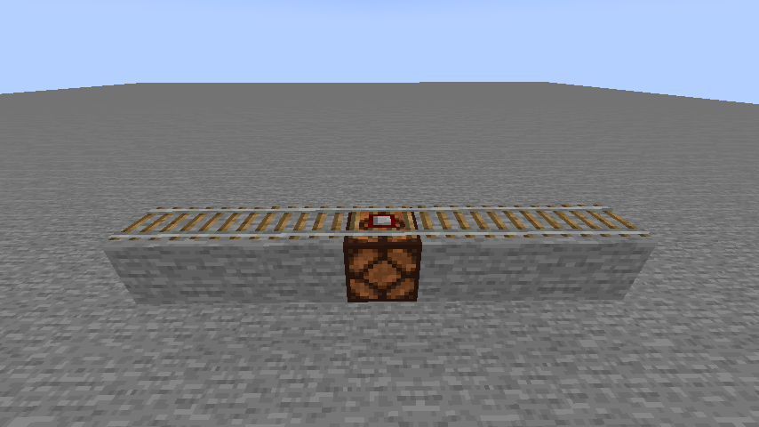
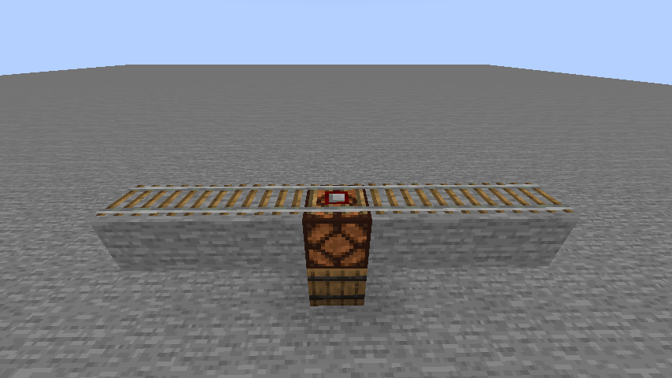
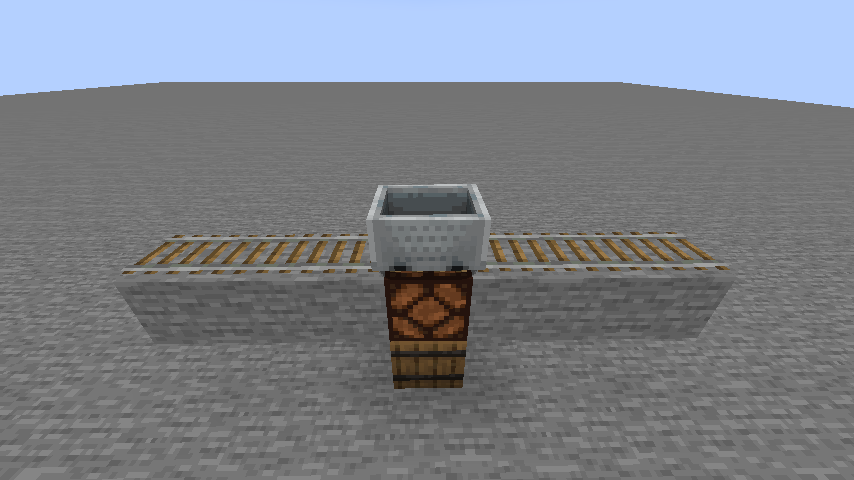
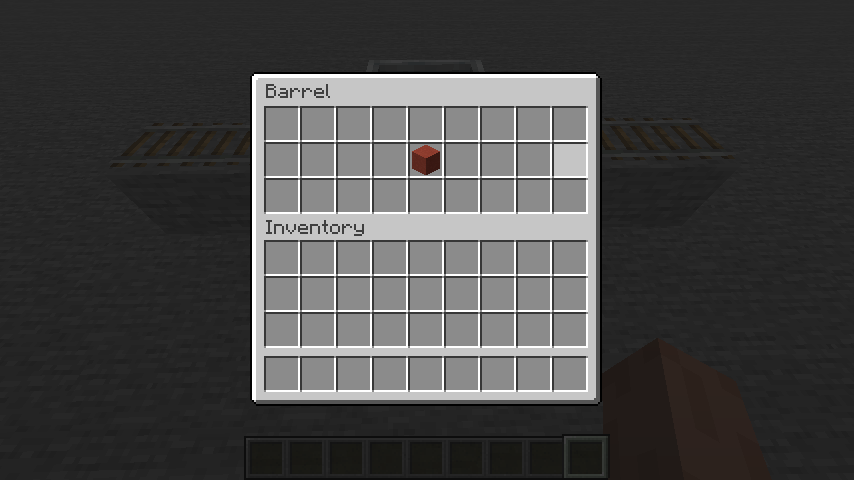
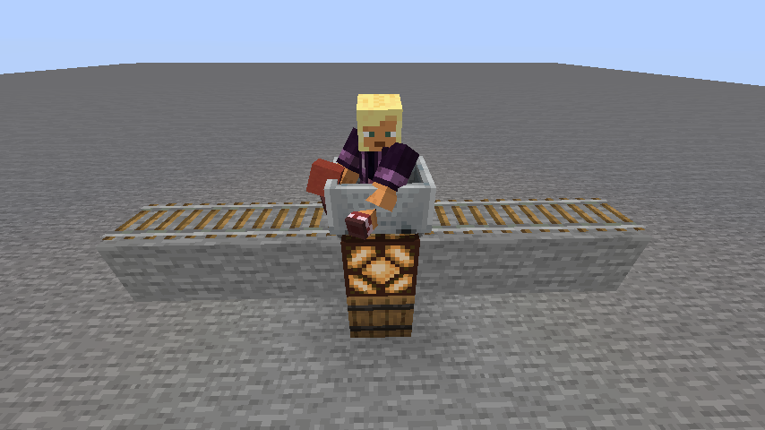

# Colorcoded Detector Rails
This mod allows for fine-tuning when if at a detector rail will activate

# Unchanged behaviour
This setup will work as it would normally. Activates whenever any minecart rides over it.

To change this behaviour, you need to place a barrel two blocks below.

From now on this detector rail will only activate for rideable minecarts whenever player 
inside of it has a correct activation item stack. Empty minecarts and minecarts of other sorts 
are ignored (for now). 

In this example the detector rail will only activate when a player has exactly one red 
terracota block in one of their slots.

We can see this behaviour here.

Player has exactly one red terracota blocks in one of their slots. Incorrect amount will cause 
detector rail to not activate. Same for wrong names and other properties. Player's activation 
stacks of items need to be exactly the same as in the configured barrel